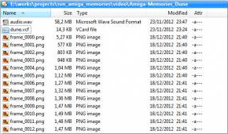

# Amiga Memories

_A walk along memory lane_ (An automatic review generator)


## How does Amiga Memories work?

Amiga Memories is a project (started & released in 2013) that aims to make video programmes that can be published on the internet. The images and sound produced by Amiga Memories are 100% automatically generated.

The generator itself is implemented in [Squirrel](http://squirrel-lang.org/), the 3D rendering is done on [GameStart 3D](https://www.youtube.com/@GameStart3D/videos).<br>
It takes advantage of the [GameStart 3D Squirrel API](https://astrofra.github.io/amiga-memories/)

### The script

An Amiga Memories video is mostly based on a narrative. The purpose of the script is to define the spoken and written content. The spoken text will be read by a voice synthesizer (Text To Speech or TTS), the written text is simply drawn on the image as subtitles.

A typical script would look like this:

```cpp
{	
	text	= "Hidden in the dezzert, are a people known as the Fremen!",
	sub	= ["Cachés dans le désert vit un peuple du nom de Fremen..."],
	led	= [{power = 1, drive = 0}, {power = 1, drive = 1}], 
	camera	= {name = "right_close", motion = "PanLeft"}	
}
```

Here, in addition to the spoken & written narration, the script controls the camera movements as well as the LED activity of the computer.

Scripts can be found in `gs_amiga_memories/assets/scripts/`. A script is, technically, a dictionnary stored as a `.nut` (Squirrel) file. It is almost identical to a _Json_ file.

### The video

Amiga Memories' video images are computed by the GameStart 3D engine (pre-[HARFANG 3D](https://github.com/harfang3d/harfang3d)). Although the 3D assets are designed to be played back in real time with a variable framerate, the engine is capable of breaking down the video sequence into 30th or 60th of a second, as TGA files.



By default, the images are generated in 720p to be assembled into a video stream ( H264 for example).

### The audio

The audio is mainly voice-over, produced by the voice synthesizer, or Text To Speech (TTS). Amiga Memories uses the open-source [MaryTTS project](http://mary.dfki.de/), developed at the [German Research Center for Artificial Intelligence](https://www.dfki.de).

### Audio video synchronisation

Once the sequence has been fully rendered, Amiga Memories exports an edit list in text format which links the various audio media needed by the project. This file lets you produce the full audio mix, in sync with the image sequence.

The Amiga Memories edit list uses the Samplitude format, and can be reviewed and remixed without any modification by tools like Reaper/Cockos.


The remix is then exported as a single WAV file, to be mixed with the final video.

### Assembling a video

Image/sound mixing is not handled by the Amiga Memories SDK.

From the TGA sequence and the exported WAV audio, it is possible to compress a final AVI file in a few clicks, using VirtualDub or MP4 with FFMPEG.

## Credits

* IDEA/SCRIPTING/RENDERING : [Astrofra](https://github.com/astrofra)
* MAIN 3D MODELING : [Saleh Al-enizi](https://www.artstation.com/hitbit911) & Gregory Thomas
* PIXELART ROBOTIC FACE : [Sven Ruthner](https://pixeljoint.com/p/2191.htm)
* 3D ENGINE : [Emmanuel Julien](https://github.com/ejulien), GameStart3D
* Text to Speech : [DFKI MARY-TTS](http://mary.dfki.de/)

## How it's done ?

Each scene is assembled using the GameStart3D editor. The objects are initially FBX files, imported into the editor.


<br>

Some of the scenes can be rendered into a texture and shown inside the monitor screen, such as this impression of the famous SOTB scrolling:


## The episodes

2 episodes are available, so far: 

* "Dune" : https://youtu.be/NTZRHCQ-pqc (The monologue of Princess Irulan, told by the Amiga)
* "The Boing Ball" : https://youtu.be/X6Xv8NsnVPs (How did the Amiga Corp team managed to create an audio sample for the Boing ball, when the OS wasn't even ready for production ?)

Several other episodes where initially planned ... maybe some day :)
* "Ghost'n'Goblins" (from the Arcade to the Amiga)
* "Athanor 2" (making of, interview of its creators)


